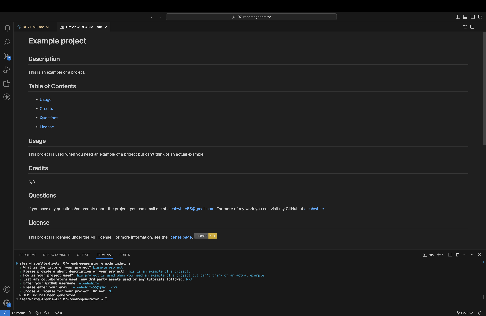

# Challenge 7 - README Generator

## Description
A command-line application using Node.js to generate README.md files. Written in JavaScript and used in the integrated terminal, by using this application you can make an informational README.md file with your GitHub and email linked for you projects by only answering a few questions. In only a few minutes without even having a file you will have a README.md file without having to type a single #.

## Images/Videos/Links
Image:

Walk-through video:
<video src="readme-generator-tutorial.mp4" controls title="walkthrough-video"></video>

Link to video on Google Drive:
https://drive.google.com/file/d/11SPskHcYTRtemNjrM8o5O6m8Z_g541Es/view

## Usage
Before using this application, you want to make sure you have Node.js installed on the local machine you will be running it on. If you have Node.js installed, you can use this application by cloning this repository to a folder of your choice, then cd-ing to '07-readmegenerator'(or what you named my repository you cloned). Once onto the repository, use 'code' command to open VSCode (If you don't have the code path installed, manually open VSCode and find the repo in the folder you chose). After you have the file open in VSCode, right-click on the folder and open the integrated terminal. Now to the fun part! In the Integrated terminal run 'npm i' to install the inquirer that's needed. Then run 'node index.js', you will be prompted with 7 questions about your project. Then you get a README.md file in Markdown with your answers! If you need more help there is a instructional video below.
https://drive.google.com/file/d/11SPskHcYTRtemNjrM8o5O6m8Z_g541Es/view

## Credits
N/A

## License
Please refer to the MIT License in the repository!
